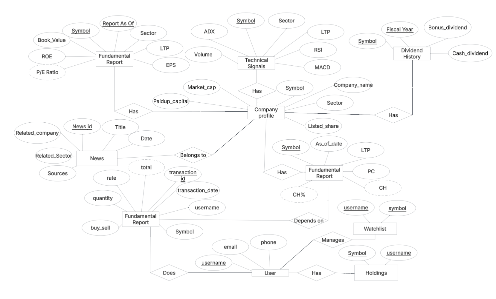

# Investment Portfolio Management Application

A full-stack application for managing investment portfolios with real-time data tracking and visualization.

## Live Demo

Visit the [live demo](https://yourusername.github.io/investment-portfolio-app) to see the application in action. 
Note: The demo version uses simulated data and has limited functionality.

## Project Structure

The project is organized into two main directories:

- **client**: Frontend React application
- **server**: Backend Node.js API

## Features

- Portfolio tracking and management
- Investment performance visualization
- Real-time market data integration
- User authentication and security
- Responsive design for mobile and desktop

## Entity Relationship Diagram

The database structure is designed based on the following ER diagram:



The diagram shows the relationships between key entities:
- Company profiles with technical signals and fundamental reports
- User accounts with holdings and watchlists
- News items related to companies
- Transaction records and dividend history

## Technology Stack

### Frontend
- React.js
- CSS/SCSS
- Chart.js for data visualization
- Axios for API requests

### Backend
- Node.js
- Express.js
- PostgreSQL database
- RESTful API architecture

## Installation

### Prerequisites
- Node.js (v14+)
- npm or yarn
- PostgreSQL

### Setup Instructions

1. Clone the repository
```bash
git clone <repository-url>
cd investment-portfolio-app
```

2. Install and start the server
```bash
cd server
npm install
npm start
```

3. Install and start the client
```bash
cd client
npm install
npm start
```

The application will be available at http://localhost:3000

## Deployment

### Deploy to GitHub Pages

1. Fork this repository
2. Update the "homepage" field in client/package.json with your GitHub username
3. Run the deployment script:
```bash
cd client
npm install
npm run deploy
```

4. Set up GitHub Pages in your repository settings to use the gh-pages branch

## API Documentation

The API endpoints include:
- `/api/auth` - Authentication endpoints
- `/api/portfolio` - Portfolio management
- `/api/investments` - Investment data
- `/api/market` - Market data integration

## License

MIT

## Contact

For any questions or feedback, please open an issue in this repository. 